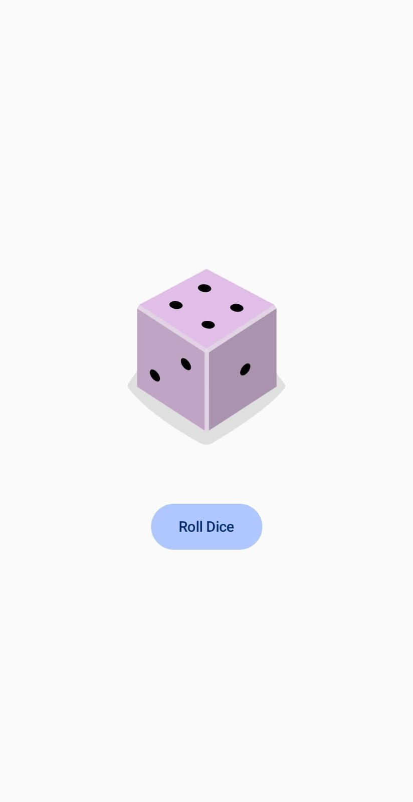

# 🎲 Dice Roller App

A simple Android application built using **Jetpack Compose** that simulates rolling a dice.  
When the user taps the **Roll Dice** button, a random dice image (1–6) is displayed.

---

## 📱 Features

- 🎲 Displays a dice image
- 🔘 Button to roll the dice
- 🔄 Generates a random number between 1 and 6
- 🎨 Built entirely using Jetpack Compose
- 📐 Vertical layout using `Column`
- 📦 Uses `Modifier` for layout customization

---

## 🛠 Tech Stack

- **Language:** Kotlin  
- **UI Toolkit:** Jetpack Compose  
- **Minimum SDK:** 24  
- **Compile SDK:** 35  
- **Android Gradle Plugin:** 8.7.3  
- **Gradle Version:** 8.10  

---
## 🧠 How It Works

1. `MainActivity` loads the UI using `setContent`.
2. `DiceRollerApp()` calls `DiceWithButtonAndImage()`.

---
## App Output

  

